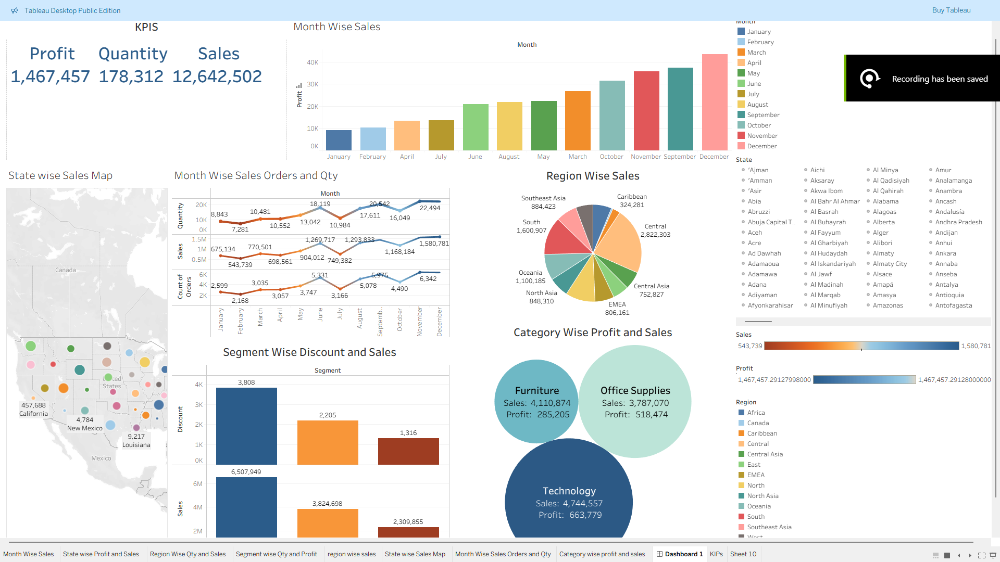
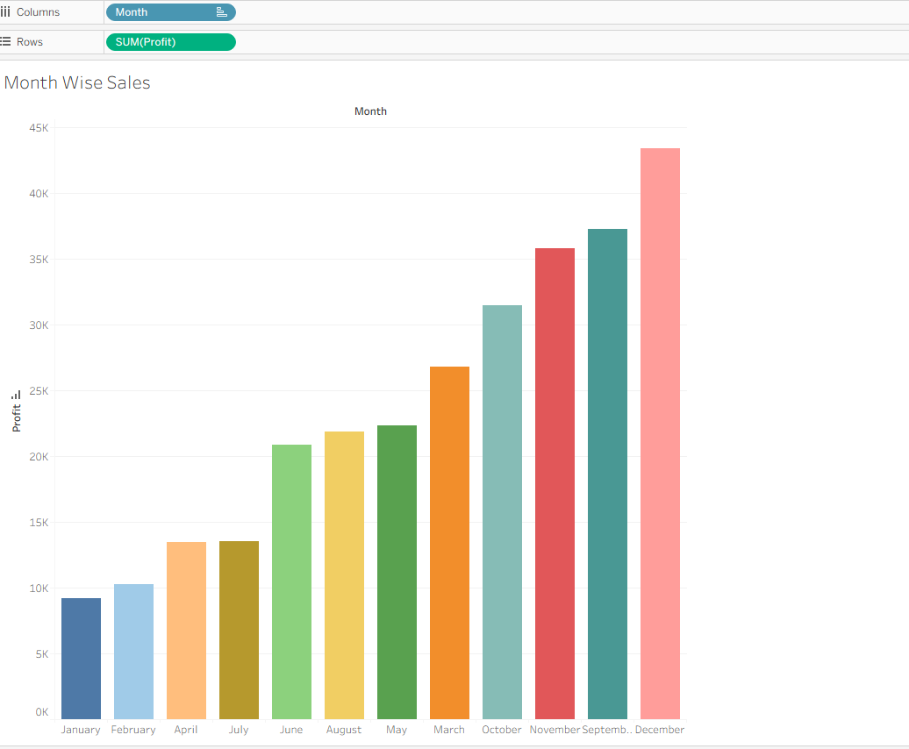
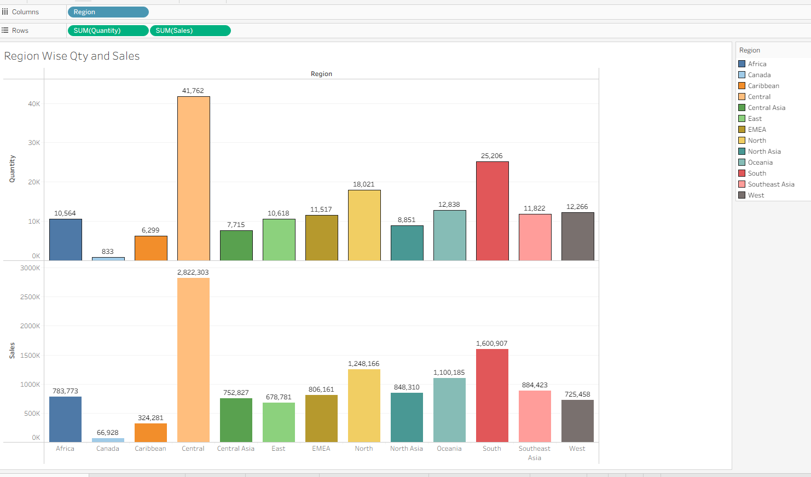
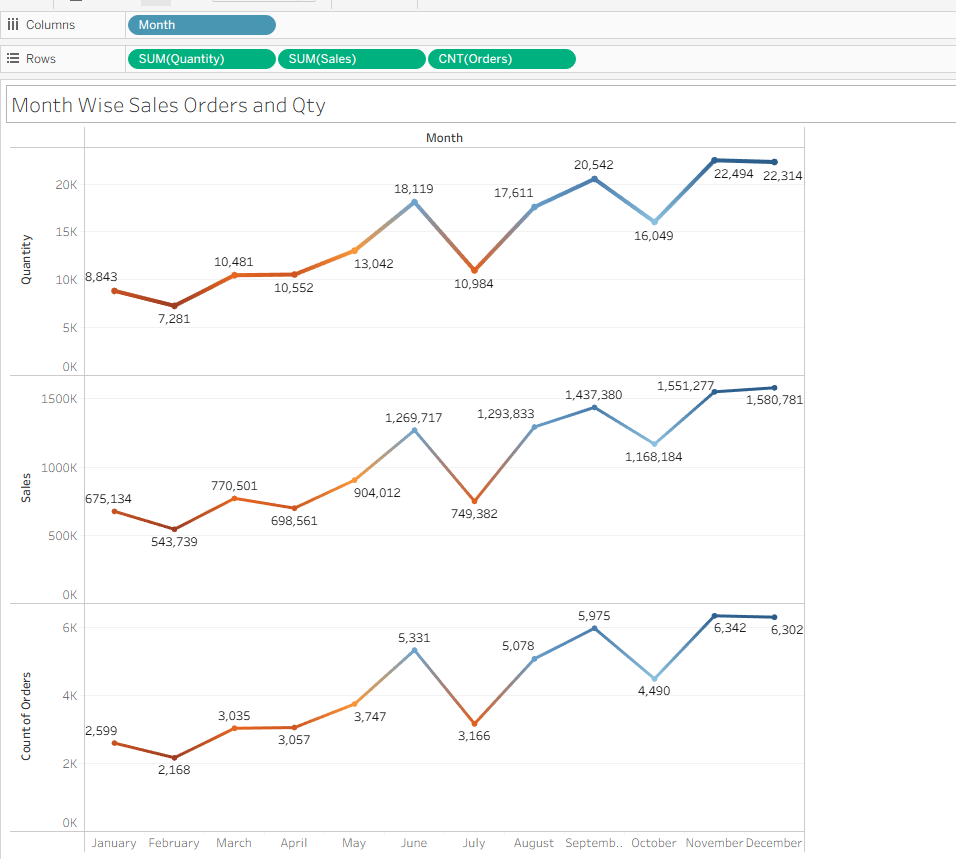
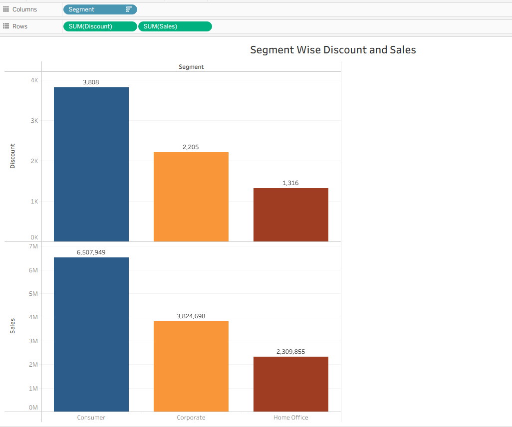

# Data Analysis with Power BI & Tableau

This repo contains all the visualizations, screenshots, and insights from my Medium article where I analyzed the **Global Store Dataset** using **Power BI** and **Tableau**.  
If you’re curious about how data turns into real business insights, this is the full breakdown.

---

## 🔍 What This Project Is About

I took a retail dataset and explored it from different angles — sales, profit, discounts, regions, customer segments, etc.  
Using Power BI and Tableau, I built dashboards that made it easier to spot trends and patterns you normally miss in raw data.

This repo collects:

- All the charts and visuals  
- Short explanations of what each visualization shows  
- Final insights and takeaways  
- Links to the full dashboards and Medium article  

---

## 📁 Dataset Used

**Global Store Dataset**  
Contains order details like:

- Order ID  
- Sales  
- Quantity  
- Profit  
- Discount  
- Region / State  
- Category & Subcategory  

Basically a perfect dataset for business analytics practice.

---

## 🛠 Tools & Techniques

- **Power BI** → Used for cleaning, DAX, and standard business dashboards  
- **Tableau** → Used for fast visual exploration and storytelling  
- **Data Cleaning** → Removed duplicates, fixed date formats, handled NA values  
- **DAX & Calculated Columns** → Month name sorting, custom measures  
- **Maps, Line Charts, Bar Charts, Pie Charts** → You’ll see all the visuals below

---

## 📊 Visuals & Insights

> **Tip:** Put all your images in a folder like `/images/` and use the Markdown below.

---

### ⭐ Full Tableau Dashboard  

**What it shows:**  
A complete overview — sales, profit, regional performance, segment breakdown, and month trends all on one screen.

---

### 📈 Monthly Sales Trend  

**Insight:**  
December crushed it with the highest profit. January sits at the bottom — not a great start to the year.

---

### 🌍 Region-wise Sales & Quantity  

**Insight:**  
The Central region leads both in total sales and total quantity. Canada has the lowest numbers overall.

### 📦 Orders, Sales & Quantity Over Month 

**Insight:**  
Sales and quantity follow a similar pattern throughout the year. Some months jump sharply due to seasonality.

### 💸 Discount vs Sales  

**Insight:**  
When discounts go up, sales also increase — classic retail behavior. Useful for planning promotions.

---

## 📝 Summary of What I Found

- December is the most profitable month  
- More discount usually means more sales  
- Central region performs the best  
- California and New York contribute the most to total revenue  
- Consumer segment brings in strong consistent profit across months  

---

## 🔗 My Social & Projects Dashboard Links

- **Medium Article:** https://medium.com/@greatadib82/analyzing-data-with-power-bi-tableau-for-visualization-and-finding-insights-that-matters-b5e93b0cc049  

- **Tableau Public Dashboard Link:**
 *https://public.tableau.com/app/profile/gazi.monirul.islam/viz/FinalSalesDashboardTableau/Dashboard1*  

- **Power BI Dashboard Link:** *(https://tinyurl.com/299mdtb8)*

## 🧠 How to View the Files

1. Clone the repo  
2. Open the `.pbix` file in Power BI Desktop  
3. Open the `.twbx` file in Tableau Desktop or Tableau Public  

---

## 🙌 Credits

Made by **Gazi Monirul Islam (aka Gazi Adib)**  
Thanks to my instructor Dr. Karim Mohammed Rezaul & Edulink for guidance and support and to the Global Store Dataset for the learning opportunity and thus enhancing my deep knowledge in Data Analytics.

