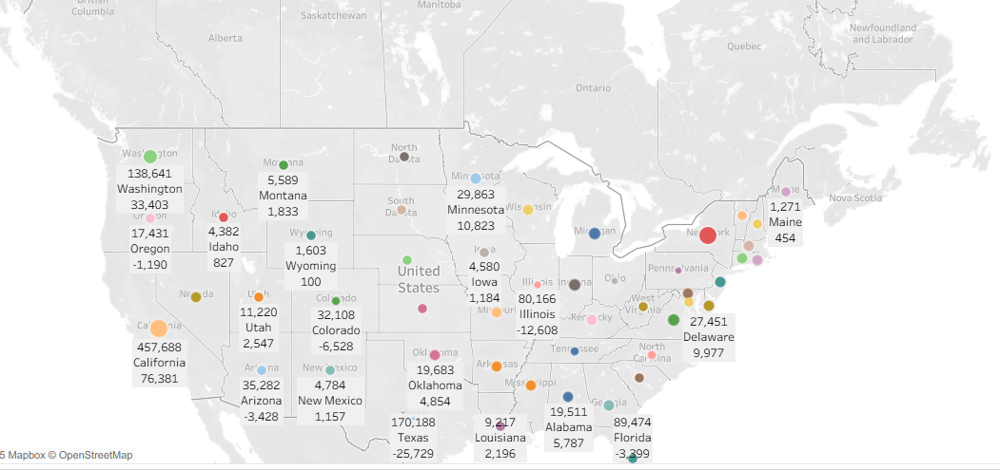

# Data Analysis with Power BI & Tableau

This repo contains all the visualizations, screenshots, and insights from my Medium article where I analyzed the **Global Store Dataset** using **Power BI** and **Tableau**.  
If you’re curious about how data turns into real business insights, this is the full breakdown.

---

## 🔍 What This Project Is About

I took a retail dataset and explored it from different angles — sales, profit, discounts, regions, customer segments, etc.  
Using Power BI and Tableau, I built dashboards that made it easier to spot trends and patterns you normally miss in raw data.

This repo collects:

- All the charts and visuals  
- Short explanations of what each visualization shows  
- Final insights and takeaways  
- Links to the full dashboards and Medium article  

---

## 📁 Dataset Used

**Global Store Dataset**  
Contains order details like:

- Order ID  
- Sales  
- Quantity  
- Profit  
- Discount  
- Region / State  
- Category & Subcategory  

Basically a perfect dataset for business analytics practice.

---

## 🛠 Tools & Techniques

- **Power BI** → Used for cleaning, DAX, and standard business dashboards  
- **Tableau** → Used for fast visual exploration and storytelling  
- **Data Cleaning** → Removed duplicates, fixed date formats, handled NA values  
- **DAX & Calculated Columns** → Month name sorting, custom measures  
- **Maps, Line Charts, Bar Charts, Pie Charts** → You’ll see all the visuals below

---

## 📊 Visuals & Insights

> **Tip:** Put all your images in a folder like `/images/` and use the Markdown below.

---

### ⭐ Full Tableau Dashboard  

**What it shows:**  
A complete overview — sales, profit, regional performance, segment breakdown, and month trends all on one screen.

---

### 📈 Monthly Sales Trend  

**Insight:**  
Let’s start with bar chart that is plotted for analyzing Month wise Profit trend and we can easily find out that December month has the got highest amount of Profit whereas January witnessed the lowest. Then gradually the profit kept increasing over the years.

---

### 🌍 Region-wise Sales & Quantity  

**Insight:**  
After that, I have implemented Region wise Qty and Sales which demonstrates region based sum of quantities sold and total sales for various regions. I found that Canada has the lowest amount of sales with only 66k sales and qty with 833 units whereas Central has the highest with 41k+ qty and also 228k+ sales overall which tells us that if the sales is high then qty is also high that also shows they are positively correlated to each other.

### 📦 Orders, Sales & Quantity Over Month 

**Insight:**  
Then, I want to show you this awesome multiple line charts which is based on month wise total orders, sales and qty which illustrates the trends in an effective way, therefore, it shows us that in the later stage of year in month December we have got the highest number of sales, orders and qty among all the previous months shown here, whereas the lowest was in February which had very low sales and orders thus it shows if the sales is low then orders is also very low thus having strong correlation among those variables. Also, over the period the sales and orders fluctuated heavily that reached it peak in December with 6k+ orders, $1500k+ sales and 22k+ qty respectively.

### 💸 Discount vs Sales  

**Insight:**  
This one is another fun insights that I got during my visualization that is if the discount amount is higher than the sales is also higher suggesting that they are so correlated and that is understandable considering people like to purchases a product if they find it cheaper with discount otherwise they don’t purchase that product which is a great insight to have. Other than that, we can observe that Consumer segment has the highest amount of sales with 6.5M+, whereas Home Office has got the lowest with 2.3M which suggest they don’t like to purchased that much compared to Corporate and Consumer Segment.

### 💸 Map Wise Profit Trend Using Latitude and Longitude

**Insight:**  
Similarly, by analyzing the Map latitude and longitude data we can observe that profit is very high on New York and California State Which we saw in our earlier visualization charts as well.

### 💸 Stacked bar Chart for Catgory Sub-category wise profit

**Insight:**  
This stacked bar chart may look fancy but I gives an accurate measure of category, sub-category wise profit pretty awesomely. we can easily visualize that from Technology category has 2 most vital sub-category that has got the highest profit which are Copiers and Phones reaching around 39% and 33% respectively. On the other hand, Office Supplies Category having 2 sub-categories with highest profit which are Appliances and Storage with nearly 28% and 21% respectively. Finally, we can observe that in Furniture Category, the two most vital sub-categories are bookcases & chairs tops the chart getting around 40% and and 34% profit margin respectively.

---

## 📝 Summary of What I Found

- December is the most profitable month  
- More discount usually means more sales  
- Central region performs the best  
- California and New York contribute the most to total revenue  
- Consumer segment brings in strong consistent profit across months  

---

## 🔗 My Social & Projects Dashboard Links

- **Medium Article:** https://medium.com/@greatadib82/analyzing-data-with-power-bi-tableau-for-visualization-and-finding-insights-that-matters-b5e93b0cc049  

- **Tableau Public Dashboard Link:**
 *https://public.tableau.com/app/profile/gazi.monirul.islam/viz/FinalSalesDashboardTableau/Dashboard1*  

- **Power BI Dashboard Link:** *(https://tinyurl.com/299mdtb8)*

## 🧠 How to View the Files

1. Clone the repo  
2. Open the `.pbix` file in Power BI Desktop  
3. Open the `.twbx` file in Tableau Desktop or Tableau Public  

---

## 🙌 Credits

Made by **Gazi Monirul Islam (aka Gazi Adib)**  
Thanks to my instructor Dr. Karim Mohammed Rezaul & Edulink for guidance and support and to the Global Store Dataset for the learning opportunity and thus enhancing my deep knowledge in Data Analytics.

